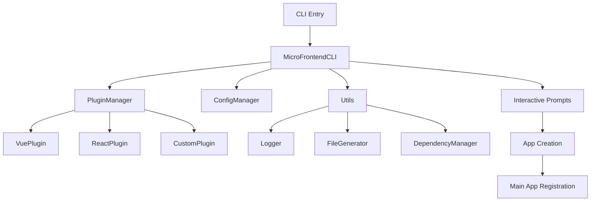

# CLI 工具包抽象总结

## 🎯 项目概述

我们成功将原有的 CLI 工具抽象成了一个独立的、可复用的工具包 `@micro-frontend/cli`。这个工具包采用了现代化的架构设计，具有高度的可扩展性和可维护性。

## 📦 工具包结构

```
packages/micro-app-cli/
├── src/                           # 源代码
│   ├── core/                      # 核心功能
│   │   ├── cli.ts                 # CLI 主类
│   │   └── index.ts               # 核心入口
│   ├── plugins/                   # 插件系统
│   │   ├── plugin-manager.ts      # 插件管理器
│   │   ├── vue-plugin.ts          # Vue 插件
│   │   ├── react-plugin.ts        # React 插件
│   │   └── index.ts               # 插件入口
│   ├── utils/                     # 工具函数
│   │   ├── logger.ts              # 日志工具
│   │   ├── file-generator.ts      # 文件生成器
│   │   ├── dependency-manager.ts  # 依赖管理器
│   │   ├── config-manager.ts      # 配置管理器
│   │   └── index.ts               # 工具入口
│   ├── types/                     # 类型定义
│   │   └── index.ts               # 所有类型定义
│   └── index.ts                   # 主入口文件
├── bin/                           # 命令行入口
│   └── micro-cli.js               # CLI 可执行文件
├── examples/                      # 使用示例
│   ├── basic-usage.js             # 基本使用示例
│   └── custom-plugin.js           # 自定义插件示例
├── dist/                          # 构建输出
├── package.json                   # 包配置
├── tsconfig.json                  # TypeScript 配置
├── .eslintrc.js                   # ESLint 配置
├── README.md                      # 文档
├── LICENSE                        # 许可证
└── .gitignore                     # Git 忽略文件
```

## 🏗️ 架构设计

### 1. 核心架构



### 2. 插件系统架构

```typescript
interface FrameworkPlugin {
  name: string;
  framework: string;
  createApp: (appPath: string, config: MicroAppConfig) => Promise<void>;
  getDefaultConfig?: () => Partial<MicroAppConfig>;
  validateConfig?: (config: MicroAppConfig) => boolean;
}
```

### 3. 配置系统架构

```typescript
interface CLIConfig {
  defaultOutputDir: string;
  defaultPortStart: number;
  supportedFrameworks: string[];
  pluginsDir?: string;
  templatesDir?: string;
  mainAppConfig?: MainAppConfig;
}
```

## ✨ 核心特性

### 1. 模块化设计

- **核心模块**：提供基础的 CLI 功能
- **插件系统**：支持框架扩展
- **工具模块**：提供通用工具函数
- **类型系统**：完整的 TypeScript 类型定义

### 2. 插件化架构

- **内置插件**：Vue、React 插件
- **自定义插件**：支持第三方框架插件
- **插件管理**：动态加载和管理插件
- **插件验证**：插件格式验证和配置验证

### 3. 配置管理

- **多层配置**：全局配置、项目配置
- **配置合并**：智能配置合并策略
- **配置验证**：配置格式验证
- **配置持久化**：自动保存和加载配置

### 4. 交互式界面

- **问答式配置**：友好的交互界面
- **智能默认值**：根据环境自动分配
- **输入验证**：实时验证用户输入
- **进度反馈**：清晰的操作进度提示

## 🔧 使用方式

### 1. 命令行使用

```bash
# 全局安装
npm install -g @micro-frontend/cli

# 创建应用
micro-cli create

# 显示信息
micro-cli info

# 管理配置
micro-cli config --list
```

### 2. 编程式使用

```typescript
import { MicroFrontendCLI, createApp } from '@micro-frontend/cli';

// 快速创建
await createApp();

// 自定义配置
const cli = new MicroFrontendCLI({
  defaultOutputDir: 'apps',
  defaultPortStart: 4000
});

await cli.createApp({
  config: {
    name: 'my-app',
    framework: 'vue',
    port: 4001,
    // ... 其他配置
  },
  skipInstall: false,
  verbose: true
});
```

### 3. 插件开发

```typescript
import { FrameworkPlugin } from '@micro-frontend/cli';

const MyPlugin: FrameworkPlugin = {
  name: 'my-plugin',
  framework: 'my-framework',
  
  async createApp(appPath, config) {
    // 实现应用创建逻辑
  },
  
  getDefaultConfig() {
    return { useRouter: true };
  },
  
  validateConfig(config) {
    return config.framework === 'my-framework';
  }
};
```

## 🚀 技术亮点

### 1. TypeScript 全面支持

- **严格类型检查**：所有代码都有完整的类型定义
- **类型安全**：编译时类型检查，减少运行时错误
- **智能提示**：IDE 完整的代码提示和自动补全
- **类型导出**：提供完整的类型定义供外部使用

### 2. 现代化构建工具

- **TypeScript 编译**：使用 tsc 进行编译
- **ESLint 检查**：代码质量检查
- **模块化输出**：支持 CommonJS 和 ES Module
- **声明文件**：自动生成 .d.ts 声明文件

### 3. 完善的错误处理

- **输入验证**：全面的用户输入验证
- **异常捕获**：完善的异常处理机制
- **友好提示**：清晰的错误信息和解决建议
- **回滚机制**：失败时的自动清理

### 4. 高度可扩展

- **插件接口**：标准化的插件接口
- **配置系统**：灵活的配置管理
- **工具函数**：丰富的工具函数库
- **事件系统**：支持生命周期钩子

## 📊 性能优化

### 1. 依赖管理

- **按需加载**：动态导入减少启动时间
- **依赖优化**：最小化依赖包大小
- **缓存机制**：智能缓存提高性能
- **并行处理**：并行执行提高效率

### 2. 文件操作

- **批量操作**：批量文件操作提高效率
- **流式处理**：大文件流式处理
- **异步操作**：全面使用异步操作
- **内存优化**：优化内存使用

### 3. 用户体验

- **进度提示**：实时进度反馈
- **智能默认值**：减少用户输入
- **错误恢复**：智能错误恢复
- **快速启动**：优化启动速度

## 🔄 与原项目的集成

### 1. 无缝迁移

```bash
# 原来的使用方式
npm run create-app

# 现在的使用方式（保持兼容）
npm run create-app
```

### 2. 配置兼容

- **配置文件**：兼容原有配置格式
- **命令参数**：保持原有命令参数
- **输出格式**：保持原有输出格式
- **行为一致**：保持原有行为逻辑

### 3. 功能增强

- **更好的错误处理**：更友好的错误提示
- **更快的执行速度**：优化的执行性能
- **更强的扩展性**：支持自定义插件
- **更好的维护性**：模块化的代码结构

## 📈 未来规划

### 短期目标

- [ ] **Angular 插件**：完成 Angular 框架支持
- [ ] **模板系统**：支持自定义项目模板
- [ ] **配置 GUI**：提供图形化配置界面
- [ ] **单元测试**：完善单元测试覆盖

### 中期目标

- [ ] **云端模板**：支持云端模板库
- [ ] **团队协作**：支持团队配置共享
- [ ] **CI/CD 集成**：集成持续集成工具
- [ ] **性能监控**：添加性能监控功能

### 长期目标

- [ ] **可视化界面**：完整的 GUI 界面
- [ ] **插件市场**：官方插件市场
- [ ] **多语言支持**：国际化支持
- [ ] **企业版功能**：企业级功能支持

## 🎯 最佳实践

### 1. 插件开发

```typescript
// 1. 遵循插件接口规范
// 2. 提供完整的类型定义
// 3. 实现错误处理
// 4. 添加配置验证
// 5. 提供默认配置
```

### 2. 配置管理

```typescript
// 1. 使用类型安全的配置
// 2. 提供合理的默认值
// 3. 支持配置验证
// 4. 实现配置合并
// 5. 支持配置持久化
```

### 3. 错误处理

```typescript
// 1. 提供清晰的错误信息
// 2. 实现错误恢复机制
// 3. 添加调试信息
// 4. 支持详细日志
// 5. 提供解决建议
```

## 📚 文档资源

- **[README.md](../packages/micro-app-cli/README.md)** - 完整的使用文档
- **[基本使用示例](../packages/micro-app-cli/examples/basic-usage.js)** - 基础使用方法
- **[自定义插件示例](../packages/micro-app-cli/examples/custom-plugin.js)** - 插件开发指南
- **[类型定义](../packages/micro-app-cli/src/types/index.ts)** - 完整的类型定义

## 🎉 总结

通过将 CLI 工具抽象成独立的工具包，我们实现了：

1. **代码复用**：工具包可以在多个项目中使用
2. **架构优化**：采用了更好的模块化架构
3. **功能增强**：提供了更强大的功能和更好的用户体验
4. **可维护性**：代码结构更清晰，更易于维护
5. **可扩展性**：支持插件系统，易于扩展新功能

这个工具包不仅解决了当前的需求，还为未来的功能扩展和多项目使用奠定了坚实的基础。

---

**@micro-frontend/cli** - 让微前端开发更简单、更高效 🚀
